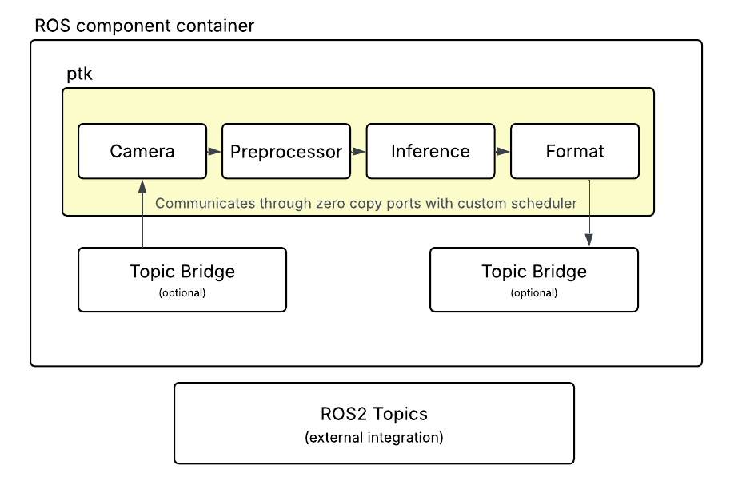

# PTK - Perception Toolkit

A high-performance, zero-copy perception pipeline framework for edge devices and robotics applications. PTK combines the modularity of ROS 2 composable nodes with custom scheduling and data flow for optimal performance.

## Features

- **Zero-copy data pipeline** using TensorView/BufferView for efficient memory usage
- **Hybrid ROS 2 integration** with composable nodes and optional topic bridges
- **Custom scheduler** with manual loop execution
- **Multiple inference backends** supporting ONNX Runtime and TensorRT
- **Image preprocessing operators** including resize, normalize, crop, color conversion
- **Camera abstraction** with support for real cameras (Mac/Linux) and synthetic sources
- **Launch file support** for declarative pipeline configuration
- **Docker support** for reproducible builds across platforms

## Architecture

PTK uses a hybrid architecture that provides the best of both worlds:



**Internal pipeline** uses custom ports and scheduler for maximum performance.
**Topic bridges** provide optional ROS 2 integration for external systems.

## Quick Start

### Prerequisites

- Docker Desktop (recommended) or local ROS 2 Humble installation
- 4GB+ RAM allocated to Docker
- For native Mac builds: OpenCV and ONNX Runtime via Homebrew

### Build with Docker

```bash
git clone https://github.com/adityaajay33/ptk
cd ptk

#build docker image
docker-compose build

#run interactive shell
docker-compose run --rm ptk
```

### Run Model Inference

The `run_model` executable runs a complete perception pipeline with your ONNX model:

```bash
#inside docker container
source /ros2_ws/install/setup.bash

#run with model file
ros2 run ptk run_model /path/to/model.onnx

#with options
ros2 run ptk run_model /path/to/model.onnx \
    --device 0 \
    --width 640 \
    --height 480 \
    --confidence 0.5 \
    --fps 30
```

Options:
- `--device <index>` - Camera device index (default: 0)
- `--width <pixels>` - Preprocessing width (default: 224)
- `--height <pixels>` - Preprocessing height (default: 224)
- `--confidence <float>` - Detection confidence threshold (default: 0.5)
- `--fps <hz>` - Target framerate (default: 30)
- `--frames <count>` - Number of frames to process (-1 for infinite)

### Run with Launch Files

Use ROS 2 launch files for declarative configuration:

```bash
ros2 launch ptk perception_pipeline.launch.py \
    model_path:=/path/to/model.onnx \
    device_index:=0 \
    target_width:=640 \
    target_height:=480
```

### Run Test Pipelines

```bash
#test synthetic camera pipeline
ros2 run ptk test_pipeline_synthetic

#test real camera
ros2 run ptk test_camera

#test inference pipeline
ros2 run ptk test_inference
```

## Components

### Sensors
- `MacCamera` - macOS/Linux camera using OpenCV
- `SyntheticCamera` - generates test pattern frames for development

### Processing
- `Preprocessor` - image preprocessing (resize, normalize, color conversion)
- `InferenceNode` - runs ONNX/TensorRT models

### Bridges
- `FramePublisherBridge` - publishes internal frames to ROS topics
- `FrameSubscriberBridge` - subscribes to ROS image topics

### Utilities
- `Counter` - simple tick counter for testing
- `Heartbeat` - periodic heartbeat for liveness checks
- `FrameDebugger` - saves frames to disk for debugging

## Custom Messages

PTK defines custom ROS messages for external integration:

- `ptk/msg/Frame` - image frame with metadata
- `ptk/msg/Detection` - single object detection
- `ptk/msg/DetectionArray` - array of detections from one frame

## Project Structure

```
ptk/
├── include/
│   ├── engines/          #inference engine interfaces
│   ├── operators/        #image preprocessing operators
│   ├── runtime/
│   │   ├── components/   #ros composable node components
│   │   ├── core/         #scheduler, ports, context
│   │   └── data/         #tensor, frame, buffer types
│   ├── sensors/          #camera interfaces
│   └── tasks/            #task contracts (detection, segmentation)
├── src/
│   ├── apps/             #test applications
│   ├── engines/          #onnx/tensorrt implementations
│   ├── operators/        #preprocessing implementations
│   ├── runtime/          #core runtime implementations
│   ├── sensors/          #camera implementations
│   └── tasks/            #task contract implementations
├── msg/                  #ros message definitions
├── launch/               #ros launch files
├── CMakeLists.txt
├── package.xml
├── Dockerfile
└── docker-compose.yml
```

## API Overview

### Creating a Pipeline

```cpp
#include "sensors/mac_camera.h"
#include "operators/preprocessor.h"
#include "runtime/components/inference_node.h"
#include "runtime/core/scheduler.h"

//create components
auto camera = std::make_shared<sensors::MacCamera>(options);
auto preprocessor = std::make_shared<Preprocessor>(options);
auto inference = std::make_shared<components::InferenceNode>(options);

//create data buffers and ports
data::Frame camera_frame, preprocessed_frame;
tasks::TaskOutput result;

core::OutputPort<data::Frame> cam_out;
cam_out.Bind(&camera_frame);
//...bind other ports...

//setup scheduler
core::Scheduler scheduler;
scheduler.Init(&context);
scheduler.AddComponent(camera.get());
scheduler.AddComponent(preprocessor.get());
scheduler.AddComponent(inference.get());
scheduler.Start();

//run with manual loop
scheduler.RunLoop(100);
```

### Using Component Loader

```cpp
#include "runtime/core/component_loader.h"

auto& loader = GetGlobalComponentLoader();

//register components
PTK_REGISTER_COMPONENT(loader, "camera", sensors::MacCamera);
PTK_REGISTER_COMPONENT(loader, "preprocessor", Preprocessor);

//create with parameters
std::map<std::string, rclcpp::ParameterValue> params;
params["device_index"] = rclcpp::ParameterValue(0);
auto camera = loader.CreateComponent("camera", params);
```

## Configuration

Components are configured via ROS parameters:

### MacCamera
- `device_index` (int, default: 0) - camera device index

### Preprocessor
- `target_width` (int, default: 224) - output width
- `target_height` (int, default: 224) - output height
- `normalize` (bool, default: true) - apply normalization
- `add_batch_dimension` (bool, default: false) - add batch dim
- `to_grayscale` (bool, default: false) - convert to grayscale
- `convert_rgb_to_bgr` (bool, default: false) - rgb to bgr

### InferenceNode
- `model_path` (string) - path to ONNX model
- `backend` (string, default: "onnx") - inference backend
- `task_type` (string, default: "detection") - task type
- `confidence_threshold` (double, default: 0.5) - detection threshold
- `nms_threshold` (double, default: 0.45) - NMS threshold
- `max_detections` (int, default: 100) - max detections per frame

### Topic Bridges
- `topic_name` (string) - ROS topic name
- `frame_id` (string) - TF frame ID for headers

## Building Natively (macOS)

```bash
#install dependencies
brew install opencv onnxruntime

#source ros2
source /opt/ros/humble/setup.bash

#build
colcon build --cmake-args -DCMAKE_BUILD_TYPE=Release

#source workspace
source install/setup.bash
```

## License

MIT License - see LICENSE file for details.
